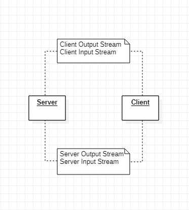

# TicTacToe

##Peer 2 Peer implementation of TicTacToe! 

I'm not quite sure if I'm going to build an interface yet, but if I do it'll be in Swing GUI.
I don't really want to be building anything too complicated.

## Class Diagram

## Explanation:

So the way this works is:  
Server and Client work both as players. They use their streams to communicate through the socket.  
Since this specific game is TicTacToe the players can't play at the same time, so whenever a player makes their move they lose the ability to play until the enemy plays.  
It sort of works like a token?

### Server and Client:

The server, joking, passes the token to the next player. Since the token is passed he first waits for the move, then plays.
Since the client and the server each verify their own moves, server does NOT have to verify client moves and vice-versa.
So they only verify their own stuff and check if goal has been found.
Client given the first move, plays and then enters the loop where the game is handled.
From there on, until the game is over, they both play, verify and wait for a play.

## .

I'm sorry if I did not go into much detail here, It's a kind of trivial example, and I didn't know what else to write!  
If you have any questions about this contact me anywhere feel free to ask!